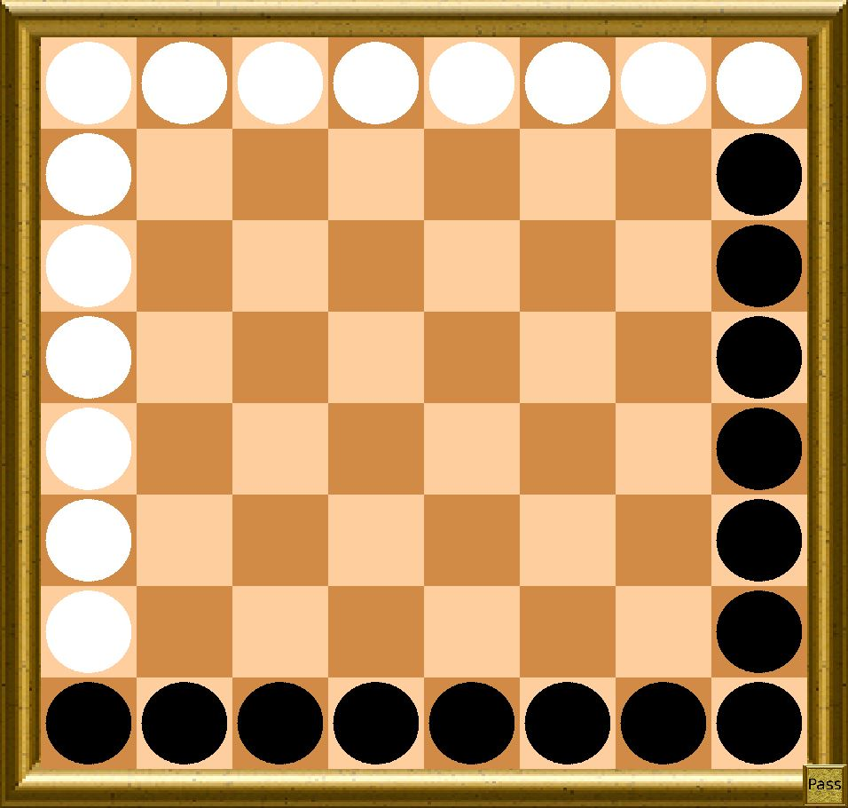
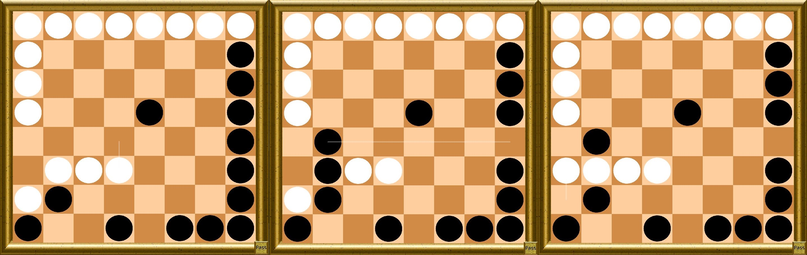

# MingMang

## Introduction

Ming Mang is a relatively unknown board game from Tibet and is played on an 8x8 board. It utilizes custodian capture of enemy pieces or a line of enemy pieces, and the captured pieces are replaced with the pieces of the player performing the capture(s); it thus resembles the games of Reversi and Othello in these respects. Each player's pieces are initially situated on two adjacent sides of the board (see figure), and move orthogonally any number of unoccupied spaces like the rook in chess. It is an elimination game, as the objective is to capture all of the opponent's pieces.

The application was created as part of the Intelligent Search Techniques course of the Artificial Intelligence Master at the University of Maastricht in 2011. The AI implemented in the application uses an alpha-beta framework, with enhancements in the form of a transposition table, move ordering techniques, search reductions, search extensions and an automatic opening book creation.

## Rules
* Players alternate their turns. Each player moves only one piece per turn. The player with the black pieces starts.
* A piece is moved orthogonally any number of unoccupied spaces. The moves are identical to the rook in chess or the pieces in Tafl.
* A player is not allowed to move a piece that brings the game back to a previous position.
* Capture of an enemy piece or a line of enemy pieces is done by the custodian method (also known as interception), and this must be created by the player performing the capture on his or her turn. The player's piece moves adjacently next to an enemy piece or line of enemy pieces that are already flanked on the other side by a friendly piece. All these pieces must be in the same row or column with no vacant space between any of them.
* Captured enemy pieces are removed at the end of the turn, and immediately replaced by one of the captor's pieces from their stock pile.
* A player is allowed to move a piece between two of the enemy's pieces on a row or column (with no vacant space between any of them) without being captured, since the enemy did not create the custodian capture on their turn. One of the enemy pieces must move away, and then return to the same position to capture the sandwiched piece if the opportunity is still available.
    * Similarly, a player is allowed to move a piece next to a line of friendly pieces which together as a group are flanked on two opposite sides by enemy pieces on a row or column (with no vacant space between any of them) without any of them being captured, since the enemy did not create the custodian capture on their turn. One of the enemy pieces must move away, and then return to the same position to capture the sandwiched pieces if the opportunity is still available.
* Multiple custodian captures can be performed in one turn. There are three general cases that exist:
    * A player moves their piece between two enemy pieces (or between two lines of enemy pieces) which are flanked on their respective opposite sides by a friendly piece (all of these pieces being on the same row or column with no space between any of them), this is cause for the capture of the enemy pieces. In this case, two custodian captures were performed but on one row or column only.
    * A player moves their piece between two enemy pieces (or between two lines of enemy pieces) in such a way that one of the enemy pieces (or one of the lines of enemy pieces) is on the same row, and the other enemy piece (or the other line of enemy pieces) is on the same column, and that each enemy piece (or each of the two lines of enemy pieces) is flanked on the other side by a friendly piece of the same row or column respectively (with no vacant space between any of them), this is cause for the capture of the two enemy pieces (or of the two lines of enemy pieces). In this case, two custodian captures were performed but one was on a row, and the other was on a column.
    * A player moves their piece between three enemy pieces (or between three lines of enemy pieces) in such a way that two of the enemy pieces (or two lines of enemy pieces) are on the same row (or column), and the third enemy piece (or third line of enemy pieces) is on the same column (or row), and that each enemy piece (each of the three lines of enemy pieces) is flanked on the other side by a friendly piece of the same row or column respectively (with no vacant space between any of them), this is cause for the capture of the three enemy pieces (or of the three lines of enemy pieces). In this case, three custodian captures were performed but two were on a row (or column), and the other was on a column (or row).
* A player wins if he or she captures all of their opponent's pieces, or stalemates their opponent's pieces by not allowing them to move on their turn.
    * Alternatively, if both players pass consecutively or a set time limit is reached, the player wins that has largest territory, where a territory is defined as the squares on the board than can be reached by a player but not by the opponent in an infinite number of non-capturing moves.

## Architecture

The program is implemented in the Java programming language and the most important classes are described as follows. The class *MingMang* is the most general class creating the game, players and GUI and runs the gameloop. Class *Data* contains data that is set before a game is played, so that no unnecessary calculations have to be done during a game. A *State* contains the information about the pieces, the moving player, position history, a hash key etc. Class *CAMMP* consists of the search algorithm used by the AI player.

The program also provides a user-friendly graphical user interface. It is possible to load or save a position, change the player type, change the visuals, pause the game or undo a move, but most importantly provides an interface for playing Ming Mang; human vs. human, AI vs. human or AI vs. AI.

The representation of the pieces is done in a way that is not used very often, but has a lot of advantages. Each player’s pieces are represented as a bitboard [1]. A bitboard is a data structure where each bit represents one square on the 8x8 board. If the i-th bit is set to 1, this corresponds to a piece being on square i. The advantages of bitboards over other data structures like arrays are the fast speed and low memory use in mass calculations. Very fast calculations can be done using bitwise operations like a bit-shift, OR, XOR, NOT or AND. For example to get all the pieces of the board a simple OR operation of black pieces and white pieces suffice.

The generation of possible moves for a piece of the board is done using magic bitboards [2]. This method uses a multiply-right-shift perfect hashing algorithm to index a bitboard database, so that afterward, the reachable squares for each piece can be received from the database in linear time.
Furthermore, several other methods are used in the program to optimize speed and memory, like the use of De Bruijn sequences and predefined bitboards for certain areas on the board.

## Artificial Intelligence

Throughout this article the AI is referred to as CAMMP, which is short for Colin’s Artificial Ming Mang Player. The following
list shows an overview of the techniques implemented:

* Alpha-beta (nega-max)
* Iterative deepening
* Transposition table's value
* Transposition table's move
* Quiescence search
* Null move
* Killer moves
* Multi cut
* History heuristics
* Late move reduction

Furthermore, temporal difference learning and Monte Carlo Tree Search is used for optimizing parameters and creating an opening book.

### Search Algorithm

CAMMP uses a negamax algorithm with alpha-beta pruning. It is a commonly used search technique for two-player games like Ming Mang. An iterative deepening method is used until either the search time is over or when the search on the next depth is unlikely to end before this time limit (a basic assumption is used; the search on the next depth will take twice as long as the search the depth just investigated). Due to optimistic play when searching on odd depths, it can occur that CAMMP makes a move according to a misleading result of a search; when a significant change exists just over the horizon of the search depth (therefore called the horizon effect). Due to this, it is safer to only search on even depths and have a pessimistic view. Each turn, CAMMP searches at most for 1/20 of the remaining time left. This means that the search time assigned per move decreases during the game. Moves in the endgame are relatively less important because the endgame in Ming Mang is either a so-called equilibrium, where both players can not improve their territory, or when a player has not much pieces left (note that the total amount of pieces on the board is always equal to 28). Both types of end games require not much search time compared to the beginning of the game since the position in an equilibrium can not be improved anyway and for the other end game not much effort is need if having a bigger number of pieces and not much can be done when being on the losing side. The fraction 1/20 is chosen because on average a game is in an equilibrium after 20 moves for one player (so 40 plies in total). 

After each search, CAMMP checks if its territory size is more than half of the board and if the retrieved score is not bigger than its score before the search. If so, it passes, else it continues to try to gather more territory or to increase its score. This means that, even if CAMMP's territory size is more than half, he will still improve its score more if it is able to do so. This is also the only way that CAMMP passes, because is does not consider passing as a move in the alphabeta search (although it uses passing in the forward pruning technique called null-move).

During the opponent's time, CAMMP makes a guess which move the opponent is most likely going to do. This guess is done using the best move according to the transposition table or, when the position is not stored in the transposition table, according to a low depth search. Then a search is done using the position acquired if the guessed moved is made. If at some point, the opponent makes a move, and the move guessed by CAMMP does not match this move, a new search is started according to the the new position and the search done during the opponent’s play time use not used. However, if the opponent's move matches the move guessed by CAMMP, the information of the search can be used to either immediately respond with the best move found (if sufficiently searched) or continue the search until satisfied (using a time threshold).

### Evaluation Function
An evaluation function is designed to assign heuristic values to non-terminal states. CAMMP uses four weighted features to determine this value:

1. number of pieces
2. Territory heuristic
3. A1 − H8 diagonal
4. Moving player bonus

The number of pieces feature is trivial, since having more pieces than the opponent is advantagious for winning the game. Considering two strong players a game normally ends before a player can capture all of the opponent's pieces. Then the territories are counted and the player with the most territory wins. CAMMP does not use this definition of a territory but consideres a territory to be the squares that can be reached by a player in exactly one move, which can not be reached by the opponent in exactly one step. This heuristic method is superior to the official territory definition in two ways. Firstly, it only requires O(n) time, because only one iteration over all pieces is needed (accessing the possible moves for each piece requires linear time). Secondly, this results in more aggressive play; when using the official territory definition it turns out that small territories are created and pieces are moved only one or two squares ahead to increase this area very slowly. The third feature’s use is to occupy the diagonal going from square A1 to H8. This area of 8 squares turns out to be important for having more territories are the end of a game, because this is the line exactly between the initial position of the black and white pieces. Finally, there is a feature which gives a small bonus to the player which is
to move. This is because it is better to be the moving player because then you are able to improve your position.

Besides the number of pieces, size of the official territory, size of territory reached in one step, number of pieces on the diagonal and the moving player bonus, some other feature were considered but turned out to decrease to AI's performance. One feature considered the number of moves a player has. Time is not an issue since this can be calculated in parallel when iterating over the pieces to count the territory's heuristic value. The problem is that in combination with the territory feature, the AI tends to play unimportant moves just in order to be more mobile. Also more features considering areas on the board were considered; the 4 corner squares, the 24 edge squares and the 4 and 16 center squares. Again, computation time is not an issue because of the use of fast bitwise operations, but the performance turned out to decrease with the addition of these extra features.

The features are considered not to be equally important and therefore weights have to be determined to get the right balance, i.e. CAMMP should prefer to capture a piece over moving a piece to the diagonal. Determining the weights is done using a combination of automatic and manual tuning. Temporal difference learning is used to get a good approximation of the best weights. This techniques requires the AI to play against itself over and over again. Before each match different weights are chosen and depending on the result, these weights are (partitially) adopted or not. This should converge to optimal weights for the evaluation function. For CAMPP, some manual tuning was still performed after this automatic techniques, according to the preferences of the creator of the AI.

### Transposition Table
A transposition table is used to store evaluations of positions for future use. A information of a retrieved position can immediately cause a cut-off or a move can be suggest and used in the move ordering. CAMMP uses two transposition tables with a fixed size of 16 bits for both. This size is chosen because it is a nice balance between memory usage and table occupation. Increasing this size leads to slower calculations and unused space, and decreasing the size resulted in a slower search due to the fact that there is just not enough space for positions to be stored, resulting in a lot of collisions. The tables are emptied before each search and after a search the tables were almost completely full evrey time. The replacement scheme used for the transposition tables is *TwoBig1*, with which the best performance should be reached according to [3].

### Move Ordering
Alpha-beta hinges on searching the best move first, because this can then lead to prunings, speeding up the search. After the transposition table’s move, CAMMP uses two killer moves and history heuristics for move ordering. Using external knowledge, like capturing moves, for move ordering appeared to be to computationally expensive in comparison with its benefits. 

Killer moves are moves that most likely produce a pruning on a certain depth. CAMMP uses two killer moves to increase chance of cutting off
unimportant subtrees. The first killer move is chosen according to which move produced the last pruning and the second killer move is chosen according to which move has the highest score on the corresponding depth (and therefore has a high probability of pruning). 

History heuristics for Ming Mang uses a 64 by 64 table to represent all the possible moves. When leaving a node the entry corresponding to the best move found for this position is increased and (after applying the other techniques) the remaining moves are ordered according to the table’s values. This is a very general and computationally cheap way to separate good from bad moves. The assumption for this is that if a move is good now, it will still be a good move in the future. Since positions which are searched deeper are more meaningful, move's value is increased by depth^2, which gave better results than increasing by 2^depth or 1.

### Variable Depth Techniques
It is often beneficial to invest more to searching into promising moves and less into bad moves. There are a lot of techniques which use this statement.
Null move, multi cut and late move reductions are techniques implemented into CAMPP which reduce the search depth for uninteresting moves. Also, quiescence is used to search deeper for promising moves.

The null move technique assumes that not moving is the worse scenario for a player. It after doing a null move and searching to a reduced depth,
still a cut-off occurs, then the node is exited. CAMMP uses passing, which is allowed in Ming Mang, to do a null move. Zugzwang can cause problems for this technique, since then passing would be beneficial for a player. Fortunately, Ming Mang does not have Zugzwang, because you are always allowed to pass in Ming Mang. CAMMP only uses the null move technique when no null move occured before in the search tree and when the distance to a leaf node is bigger than the depth reduction. The depth reduction is set to a value of 2. Furthermore, a null move is searched using a minimal window from −beta to −beta+1. 

Multi cut is a depth reduction technique that assumes that if at least C of the M children of a position produce a beta pruning (at reduced depth), this
position is bad and the node is exited. Unfortunately, if this condition fails, all the M moves have to be searched again. CAMPP uses for C a value of 3, for M a value of 10 and the depth is again reduced by 2. 

Late move reduction is the last search reduction technique used by CAMMP and works as follows. The first m moves of a position (also counting the transposition table’s move and the killer moves) are searched at full depth, while the remaining moves are searched to a lower depth. In combination with a good move ordering (so that the m first moves are indeed the most promising), this technique is very efficient. For CAMPP, m equals 5.

In stead of limiting the depth for non-promising moves, one could also increase the depth for promising moves. One technique which can be used is
quiescence search. In stead of returning the evaluation value what at a leaf node, this method checks if the current position is quiet or not. If it is not quiet is continues the search until it is. For CAMPP, quiet is considered to be a position in which the last move was no capture. Another possibility for defining quiet states can be positions in which it is not able to capture something. The disadvantage of the latter is that it requires an iteration over the board to check for possible capture moves, but the advantage is that a quiet position is reached one move earlier. Unfortunately, the Ming Mang game has the property that a very long sequence of captures can occur. Experiments showed that it is possible that at the first move for white a sequence of over 1000 capturing moves could be occur, possibly much more if there would be no memory constraints. Due to this, the quiescence search incorporated in CAMMP has a depth limit of 6.

### Opening Book

To speed up the play during the beginning op a game, CAMMP uses an opening book. This book is created using a meta Monte Carlo Tree Search technique
similar to Quasi Best-First [4,5]. A tree is iteratively expanded using CAMMP for the playouts, and within the tree the node with the highest winning ratio is chosen. The only difference with with QBF is that with a small probability a random move is chosen in the tree (leading to either an already existing node with lower win ratio or leading to an immediate expansion). This makes sure that the tree is not too shallow. After the creation of the opening book, a manual clean up of nodes has been done to remove mutated moves, which have been chosen by the random factor but proved to be bad moves. Unfortunately, because of the fact that the opening book is fairly small and the correctness of the results are doubtfull (due to minimal available timefor the creation of the book), it is disabled by default.

## Experiments 

### Time Complexity

The table below shows the average amount of time needed for CAMMP to search up to a certain depth. An average over the first 10 moves is taken over a high number of games. Note that the depths are without the possible additional 6 depths of the quiescence search. The tests are performed on an old laptop with an old 1.7GHz single core processor.

| Depth |  Average Search Time (in milliseconds) | 
| ----- | ---------------------------------------| 
| 2     | 25                                     | 
| 4     | 280                                    | 
| 6     | 4,425                                  | 
| 8     | 33,602                                 | 

It can be seen that up to depth 6 can be searched in a reasonable amount of time. When the total time for a game is 15 minutes, CAMMP reserves around
45 seconds for its first move and this time slowly decreases after each move. With this time settings, most of the time CAMMP is able to search up to depth 8. Sometimes a depth 10 search is done later on in a game and very rarely a depth 12 search was observed. This depends on the number of moves available and its ordering.

### Space Complexity

See the table below for the average amount of nodes expanded during a depth 4 search. Expanding less nodes means less computation time
and therefore more time to search deeper. Again, an average over the first 10 moves of multiple games are taken.

| AI                                    | Average nodes expanded    | 
| ------------------------------------- | ------------------------- | 
| alpha-beta with quiescence search     | 550,477                   | 
| alpha-beta                            | 243,820                   | 
| alpha-beta with null move             | 237,897                   | 
| alpha-beta with multi cut             | 218,994                   | 
| alpha-beta with transposition tables  | 166,481                   | 
| alpha-beta with late move reduction   | 146,167                   | 
| alpha-beta with killer moves          | 64,636                    | 
| alpha-beta with history heuristics    | 44,851                    | 
| CAMMP without late move reduction     | 21,395                    | 
| CAMMP without multi cut               | 16,329                    | 
| CAMMP without quiescence search       | 9,078                     | 
| CAMMP without history heuristics      | 8,996                     | 
| CAMMP without null move               | 6,739                     | 
| CAMMP without transposition tables    | 6,278                     | 
| CAMMP without killer moves            | 5,870                     | 
| CAMMP                                 | 5,859                     | 

It can be seen from the table that all techniques increase the performance, i.e. all cause the amount of nodes in the search tree to decrease in comparison with plain alpha-beta, except for quiescence search. This technique is a search extension and therefore expands more nodes, although applied with other techniques the deeper search can cause more prunings in the rest of the search. Another conclusion is that when only implementing simple techniques, they have a very big impact on the search tree, but in combination with other techniques they appear to have only a small impact. For example implementing killer moves for alpha-beta decreases the search tree approximately 7-fold, but in combination with all other techniques, killer moves reduce the search tree only with 11 nodes in this case.

## References

1. Chess programming - bitboards, [https://www.chessprogramming.org/Bitboards](https://www.chessprogramming.org/Bitboards).
2. Chess programming - magic bitboards, [https://www.chessprogramming.org/Magic_Bitboards](https://www.chessprogramming.org/Magic_Bitboards).
3. D. Breuker, J. W. H. M. Uiterwijk, and H. J. V. D. Herik, "Replacement schemes for transposition tables", ICCA Journal, vol. 17, pp. 183-193, 1994.
4. M. Guillaume, J. B. Hoock, J. Perez, A. Rimmel, O. Teytaud, and M. H. M. Winands, "Meta monte-carlo tree search for automatic opening book generation", personeelunimaasnl, no. 3, pp. 1-6, 2010.
5. P. Audouard, G. Chaslot, J.-B. Hoock, A. Rimmel, J. Perez, and O. Teytaud, "Grid coevolution for adaptive simulations; application to the building of opening books in the game of go", 2009.
